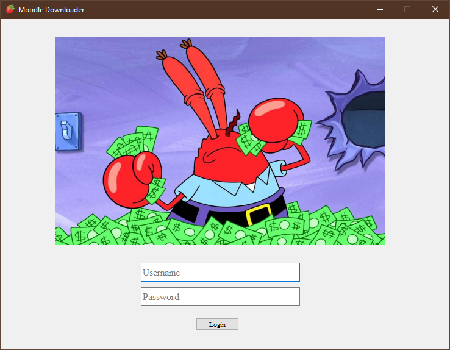
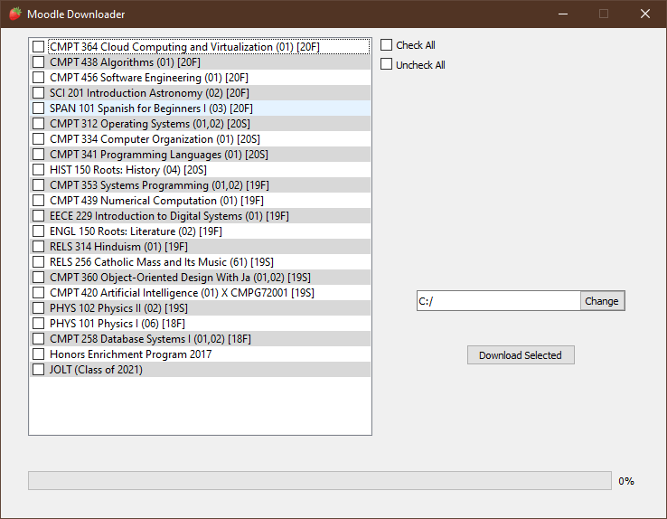

# Moodle-Requests

Created by Sanjay Sewbhajan

Able to download all files from a courses and save them in created directory named after title of course. Ability to also parse assignments from course and return data. 

*Recently Integrated with my Discord Bot*

**Next Steps:**
+ [x] Ability to search for course instead of manually key entry
+ [x] Ability to Download All Course Teaching Files
+ [x] Build GUI for Downloader
+ [ ] Change Download Process to Background (Multithreading)
+ [ ] Live Update Notification when professors post assignments
+ [ ] Ability to submit assignments

**Screenshot:**

Here is the login page on the application:

After logging in, you will be presented with a checklist of all courses you have taken using Moodle. You must select the courses you want to download and then select a location for the download to be save:

