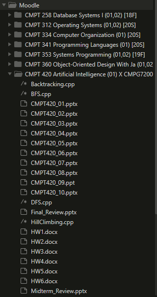

# Moodle-Requests

Created by Sanjay Sewbhajan

Able to download all files from a courses and save them in created directory named after title of course. Ability to also parse assignments from course and return data. 

*Recently Integrated with my Discord Bot*

**Next Steps:**
+ [x] Ability to search for course instead of manually key entry
+ [ ] Live Update Notification when professors post assignments
+ [ ] Ability to submit assignments

**Screenshot:**

